# Element 仕様書

> 最終更新: 2026-02-10

## 1. ゲーム概要

**Element**は、様々なオブジェクトに乗り移って進む**2Dパズルプラットフォーマー**です。

### コンセプト
- プレイヤーの本体は「**目（Dark）**」として表現される
- フォーカスモードで乗り移り可能なオブジェクトを確認し、最適なものに乗り移る
- 各オブジェクトは固有の能力を持ち（移動、ジャンプ、浮遊など）、それらを駆使してパズルを解く
- **メトロイドヴァニア**形式の探索型マップ
- マリオオデッセイの「キャプチャ」に近い乗り移りメカニクス

---

## 2. コアメカニクス

### 2.1 乗り移りシステム

#### フォーカスモード
- **起動**: ボタン長押し
- **効果**: 
  - ゲーム時間が減速（倍率は調整可能、デフォルト0.3倍）
  - 乗り移り可能なオブジェクトが視覚的にハイライト表示
  - 移動などの通常入力は無効化
- **解除**: ボタンを離す

#### 乗り移り判定

フォーカスモード中、オブジェクトは3段階で表示される：

1. **フォーカス外** - 何も表示されない（乗り移り不可）
2. **候補** - 乗り移り可能だが最適ではない（スプライトで提示）
3. **最適ターゲット** - 現在乗り移り可能（強調表示/エフェクト）

**最適ターゲットの選定条件**：
- オブジェクトの**コア**がカメラから見えている
- **AND** 現在Possess中のコアに最も近い

#### 乗り移り実行
- フォーカスモード中に乗り移り入力
- 最適ターゲットに乗り移る
- 古いオブジェクトの状態を解除、新しいオブジェクトにPossess

### 2.2 Dark（プレイヤー本体）

- プレイヤーの本体である「目」
- デフォルトのIPossable
- 他のオブジェクトに乗り移ると、古いDarkは自動で破棄される
- Darkも死亡する可能性がある

#### リスポーン
- 任意のIPossableが死亡すると、**DarkSource**の位置に新しいDarkが生成される
- DarkSourceはステージごとに配置可能（複数存在可能）
- StageManagerが現在アクティブなDarkSourceを管理

---

## 3. 技術設計

### 3.1 インターフェース設計

#### IPossable（基本インターフェース）

すべての乗り移り可能なオブジェクトが実装。

```csharp
public interface IPossable
{
    void TryPossess();           // 乗り移り入力通知
    int Layer { get; }           // 独自レイヤーシステムの順序値
    bool IsPossess { get; set; } // 現在乗り移られているか
    Transform Core { get; }      // コア（視認性・距離判定用）
    void Death();                // 死亡処理
}
```

**設計のポイント**：
- `Core`は子オブジェクトとして実装
- `Layer`は描画順序を明示的に指定（SortingLayerとは独立）
- `IsPossess`がtrueの間のみ、そのオブジェクトは入力を受け付ける

#### 能力インターフェース

IPossableの能力を組み合わせ可能にするインターフェース群。

**IHorizontalMovable** - 横移動
```csharp
public interface IHorizontalMovable
{
    void MoveHorizontal(float direction); // -1:左, 1:右, 0:停止
}
```

**IVerticalMovable** - 縦移動
```csharp
public interface IVerticalMovable
{
    void MoveVertical(float direction); // -1:下, 1:上, 0:停止
}
```

**IJumpable** - ジャンプ
```csharp
public interface IJumpable
{
    void Jump();
}
```

**実装パターン**：
```csharp
public class Box : MonoBehaviour, IPossable, IHorizontalMovable, IJumpable
{
    void Start()
    {
        // IsPossess中のみ入力を受け付ける
        InputProcessor.Instance.Move
            .Where(_ => IsPossess)
            .Subscribe(dir => MoveHorizontal(dir.x))
            .AddTo(this);
    }
}
```

#### IDoublable（分身システム）

二つに分かれることができるオブジェクト用。IPossableを継承。

```csharp
public interface IDoublable : IPossable
{
    bool IsSplit { get; }
    void Split();
    void Merge();
    IPossable GetOtherHalf();
}
```

### 3.2 マネージャーアーキテクチャ（VContainer + R3）

**設計方針**：
- **VContainer**による依存性注入で柔軟な設計
- **イベントを目的別に分離**し、神クラスを回避
- 各マネージャーは必要なイベントインターフェースだけに依存
- R3（ReactiveProperty/Subject）によるイベント駆動

#### イベントインターフェース設計

イベントを5つのインターフェースに分離：

**IGameStateEvents** - ゲーム状態イベント
```csharp
public interface IGameStateEvents
{
    ReactiveProperty<GameState> CurrentGameState { get; }
}
```
利用者: InputProcessor, TimeManager, PossessionManager

**IPossessionEvents** - 乗り移りイベント
```csharp
public interface IPossessionEvents
{
    ReactiveProperty<IPossable> CurrentPossessed { get; }
    Subject<PossessionChangeEvent> OnPossessionChanged { get; }
    Subject<IPossable> OnPossessableDeath { get; }
}
```
利用者: PossessionManager, CameraController

**IFocusEvents** - フォーカスモードイベント
```csharp
public interface IFocusEvents
{
    Subject<bool> OnFocusModeChanged { get; }
}
```
利用者: TimeManager, PossessionManager, InputProcessor

**ICameraEvents** - カメラ遷移イベント
```csharp
public interface ICameraEvents
{
    Subject<CameraTransitionEvent> OnCameraTransition { get; }
}
```
利用者: TimeManager, InputProcessor, CameraController

**IStageEvents** - ステージ管理イベント
```csharp
public interface IStageEvents
{
    ReactiveProperty<DarkSource> ActiveDarkSource { get; }
    Subject<DarkSource> OnActiveAreaChanged { get; }
}
```
利用者: PossessionManager, StageManager

#### マネージャー一覧

| マネージャー | 責務 | 依存するイベント |
|------------|------|----------------|
| **GameStateManager** | ゲーム状態管理 | IGameStateEvents（発行） |
| **PossessionManager** | 乗り移りシステム | IPossessionEvents, IStageEvents, IGameStateEvents |
| **TimeManager** | Time.timeScale制御 | IFocusEvents, ICameraEvents |
| **StageManager** | DarkSource管理 | IStageEvents（発行） |
| **InputProcessor** | 入力管理と配信 | IGameStateEvents, IFocusEvents（発行） |
| **CameraController** | カメラ制御 | IPossessionEvents, ICameraEvents（発行） |

#### VContainer設定

**GameLifetimeScope**でイベントとマネージャーを登録：

```csharp
public class GameLifetimeScope : LifetimeScope
{
    protected override void Configure(IContainerBuilder builder)
    {
        // イベント登録（Singleton）
        builder.Register<IGameStateEvents, GameStateEvents>(Lifetime.Singleton);
        builder.Register<IPossessionEvents, PossessionEvents>(Lifetime.Singleton);
        builder.Register<IFocusEvents, FocusEvents>(Lifetime.Singleton);
        builder.Register<ICameraEvents, CameraEvents>(Lifetime.Singleton);
        builder.Register<IStageEvents, StageEvents>(Lifetime.Singleton);

        // マネージャー登録
        builder.RegisterComponentInHierarchy<GameStateManager>();
        builder.RegisterComponentInHierarchy<PossessionManager>();
        // ...
    }
}
```

#### 依存関係図（Mermaid）

```mermaid
classDiagram
    %% イベントインターフェース
    class IGameStateEvents {
        <<interface>>
        +ReactiveProperty~GameState~ CurrentGameState
    }
    
    class IPossessionEvents {
        <<interface>>
        +ReactiveProperty~IPossable~ CurrentPossessed
        +Subject~PossessionChangeEvent~ OnPossessionChanged
        +Subject~IPossable~ OnPossessableDeath
    }
    
    class IFocusEvents {
        <<interface>>
        +Subject~bool~ OnFocusModeChanged
    }
    
    class ICameraEvents {
        <<interface>>
        +Subject~CameraTransitionEvent~ OnCameraTransition
    }
    
    class IStageEvents {
        <<interface>>
        +ReactiveProperty~DarkSource~ ActiveDarkSource
        +Subject~DarkSource~ OnActiveAreaChanged
    }

    %% マネージャー
    class GameStateManager {
        +ChangeState(GameState)
    }
    
    class PossessionManager {
        +PossessTo(IPossable)
        +OnPossessableDeath(IPossable)
        -RespawnAsDark()
    }
    
    class TimeManager {
        +SetTimeScale(float)
        +EnterFocusMode()
        +ExitFocusMode()
    }
    
    class StageManager {
        +SetActiveDarkSource(DarkSource)
        +TransitionToArea(string)
    }
    
    class InputProcessor {
        +ReactiveProperty~Vector2~ Move
        +Subject~Unit~ PossessInput
        +Subject~Unit~ Jump
    }
    
    class CameraController {
        +MoveToArea(Transform, float, float)
        +FollowTarget(Transform)
    }

    %% VContainer注入関係
    IGameStateEvents <.. GameStateManager : publishes
    IGameStateEvents <.. InputProcessor : subscribes
    IGameStateEvents <.. PossessionManager : subscribes
    
    IPossessionEvents <.. PossessionManager : publishes
    IPossessionEvents <.. CameraController : subscribes
    
    IFocusEvents <.. InputProcessor : publishes
    IFocusEvents <.. TimeManager : subscribes
    IFocusEvents <.. PossessionManager : subscribes
    
    ICameraEvents <.. CameraController : publishes
    ICameraEvents <.. TimeManager : subscribes
    
    IStageEvents <.. StageManager : publishes
    IStageEvents <.. PossessionManager : subscribes
```



#### 依存関係マトリックス

| マネージャー | GameState | Possession | Focus | Camera | Stage |
|------------|-----------|------------|-------|--------|-------|
| **GameStateManager** | 🟢発行 | - | - | - | - |
| **InputProcessor** | 🔵購読 | - | 🟢発行 | - | - |
| **TimeManager** | - | - | 🔵購読 | 🔵購読 | - |
| **PossessionManager** | 🔵購読 | 🟢発行 | 🔵購読 | - | 🔵購読 |
| **StageManager** | - | - | - | - | 🟢発行 |
| **CameraController** | - | 🔵購読 | - | 🟢発行 | - |

**設計の特徴**：
- ✅ **明示的な依存**: コンストラクタで依存が一目瞭然
- ✅ **責務の分離**: イベントが目的別に整理
- ✅ **神クラス回避**: 各マネージャーは必要な情報のみ参照
- ✅ **テスト容易**: モックインターフェースで簡単にテスト可能
- ✅ **拡張性**: 新しいイベントの追加が既存コードに影響しない


### 3.3 コア視認性判定

オブジェクトのコアが他のスプライトに覆われているかを判定。

**検討中の実装方法**：
1. **Physics Raycast**（プロトタイプ推奨）
   - カメラからコアへRaycastを飛ばして遮蔽物をチェック
   - シンプルで実装が容易
   
2. **SortingLayer/OrderInLayer**
   - 描画順序を使った判定
   - 視覚的に正確だが複雑
   
3. **カスタムレイヤーシステム**（本番推奨）
   - IPossable.Layerを活用した独自判定
   - 制御しやすく、パフォーマンスも良好

**実装優先度**: プロトタイプはRaycast → 正式版はカスタムレイヤー

---

## 4. ゲームフロー

### フォーカス → 乗り移り

```
1. プレイヤーがフォーカスボタン長押し
   ↓
2. GameStateManager: FocusModeに遷移
   ↓
3. TimeManager: 時間を減速（0.3倍）
   ↓
4. PossessionManager: 最適ターゲットを選定・更新（毎フレーム）
   ↓
5. プレイヤーが乗り移り入力
   ↓
6. PossessionManager: PossessTo(最適ターゲット)
   - 古いオブジェクトのIsPossess = false
   - Darkなら破棄
   - 新しいオブジェクトのIsPossess = true
   ↓
7. GameEvents: OnPossessionChangedイベント発行
   ↓
8. フォーカスモード終了 → 時間を通常に戻す
```

### 死亡 → リスポーン

```
1. IPossable.Death()が呼ばれる
   ↓
2. PossessionManager.OnPossessableDeath()
   ↓
3. StageManager.CurrentDarkSourceを取得
   ↓
4. DarkSourceの位置に新しいDarkを生成
   ↓
5. PossessionManager.PossessTo(新Dark)
```

---

## 5. オブジェクト実装例

| オブジェクト | 能力 | 説明 |
|------------|------|------|
| **Dark（闇）** | `IHorizontalMovable` | プレイヤー本体。横移動のみ。すべての起点 |
| **Spring（ばね）** | `IHorizontalMovable, IJumpable` | 横移動とジャンプが可能 |
| **Box（箱）** | `IHorizontalMovable` | 横移動のみ。踏める（接地可能） |
| **Elevator（エレベーター）** | `IVerticalMovable` | 縦移動のみ ※将来的にパス移動も検討 |
| **Balloon（気球）** | `IHorizontalMovable, IVerticalMovable` | 横移動と縦移動が可能 |
| **Rock（岩）** | `IPossable`のみ | 移動不可。重しとして使用 |

---

## 6. 技術スタック

- **Unity 6000.3+** (URP)
- **C# 6000.0+**
- **VContainer** - 依存性注入（DI）コンテナ
- **R3** - リアクティブプログラミング（イベント駆動）
- **LitMotion** - カメラ移動のトゥイーン
- **Input System** - 入力管理
- **UniTask** - 非同期処理

- **VContainer** - 依存性注入
---

## 7. 今後の拡張可能性

### 能力の追加
- `IDashable` - ダッシュ能力
- `ISwimmable` - 水中移動
- `IGlidable` - 滑空
- `IPushable` - オブジェクトを押す。動かす

### IDoublable活用
- 二つに分かれて同時に操作
- パズル要素として両方のコアを特定の位置に配置

### ステージギミック
- ボタン/スイッチ（IPressable）
- 動く床（IMovingPlatform）
- ワープゾーン
- 時間制限エリア


#### 設計について
- GameEventsが神クラスになっている。
明らかに関係のないマネージャーもGameEventsを介して通信してしまっている。ので、必要な情報だけを取捨するようにできていない。フォーカスモード周りのイベントや、ステージ移動だけのイベントのから必要なものを適宜抜き取るという形にしたい、今のウニのような設計ではなく、より柔軟な設計にしたい。また、VContainerを使って依存性をより柔軟にできないか？